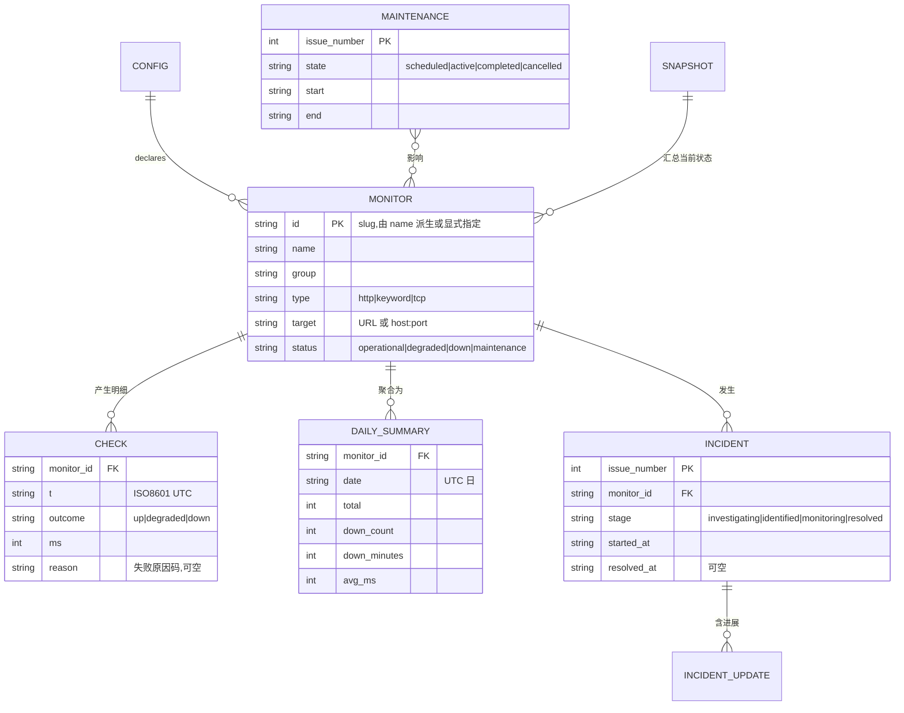
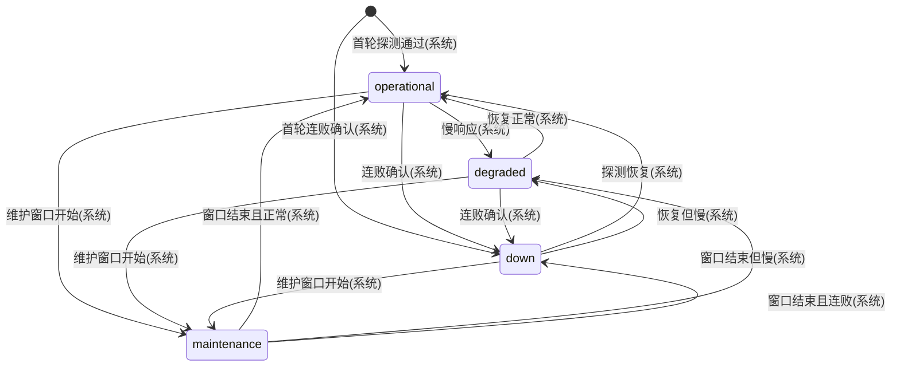
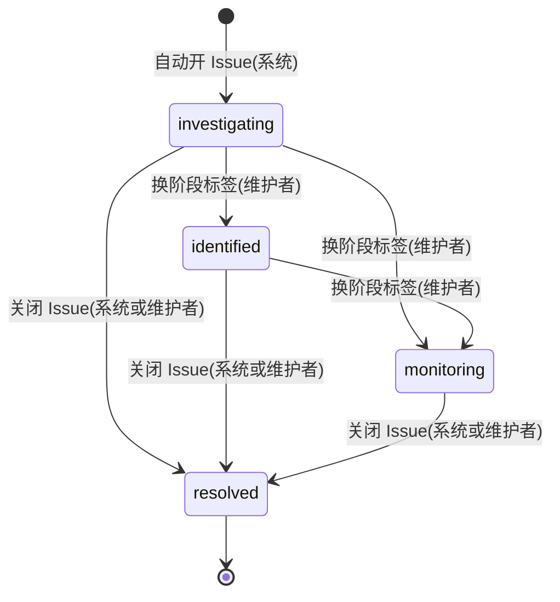
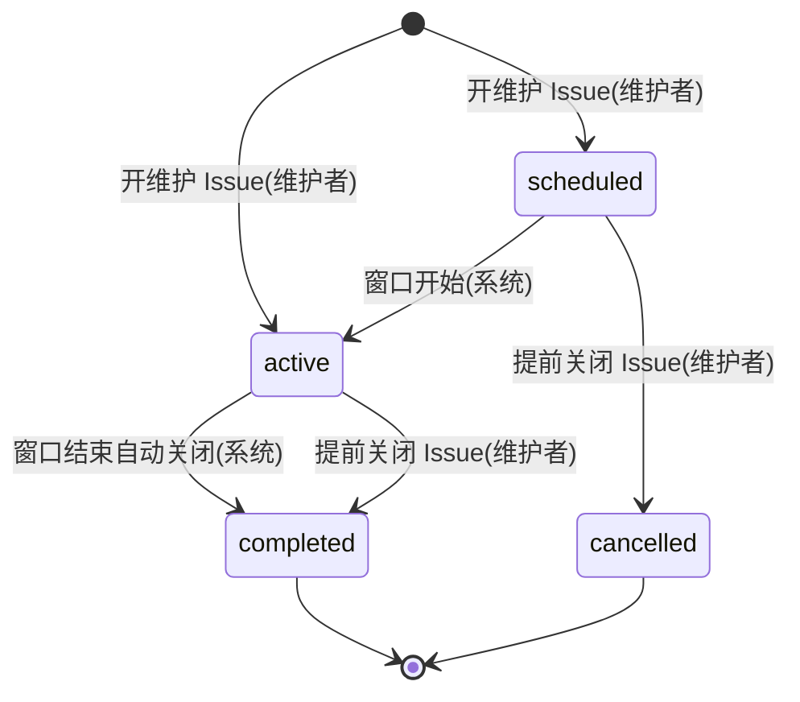
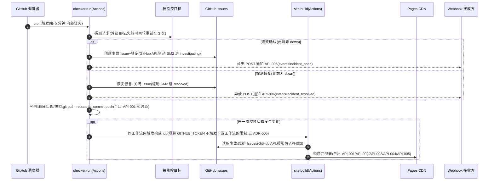
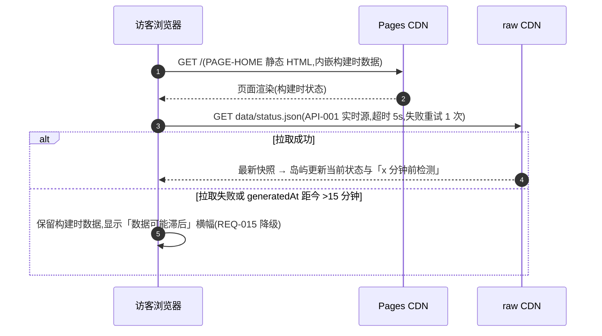
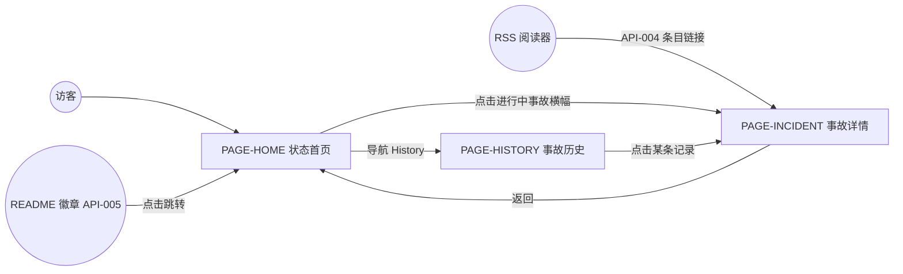

# Butus · GitHub 原生开源 Status Page 模板 设计文档

## 1. 元信息 / 变更记录

| 字段 | 值 |
| --- | --- |
| 状态 | 已批准 |
| 项目画像 | 生产产品(模板供外部开发者使用,其状态页面向公网访客;无中心化运行时的节按场景级 N/A 处理) |
| Owner | bug |
| 评审人 | bug |
| 最后更新 | 2026-07-27 |
| 关联 | 仓库 github.com/Bearisbug/Butus(本地 /Users/bug/Documents/Projects/Status) · 契约 `schema/*.schema.json`(随实现入仓) · 测试文档 `docs/TEST.md`(设计确认后建立) |

变更记录:

| 日期 | 版本 | 改动 | 作者 |
| --- | --- | --- | --- |
| 2026-07-27 | v0.1 | 初稿:全量设计 | bug |
| 2026-07-27 | v1.0 | 用户评审确认,状态转已批准 | bug |
| 2026-07-28 | v1.1 | 实现期修订:ADR-002 v1 交互用原生 script,不装 React 运行时(升级路径保留);§9 明细增 maint 字段(维护窗口内探测标记,聚合时剔除) | bug |
| 2026-07-28 | v1.2 | 用户视觉迭代:ADR-002 图表改 React 岛屿 + Recharts(用户点名);§15 岛屿 JS 预算相应调整(图表懒加载另计) | bug |
| 2026-07-28 | v1.3 | 边缘加固:§9 monitors[].id 保留值 overall 禁用、探测跟随重定向按最终响应判定;Issue 列表过滤 PR;超长文本渲染约束(实现层) | bug |
| 2026-07-28 | v1.4 | 审查修复:日汇总重算排除 7 天窗口边界残缺日(防历史失真);维护元数据解析兼容 CRLF;§14 增 http_unexpected 原因码;部署并发组降到 job 级(reusable 场景生效);checker 启动时确保标签集存在;Issue 列表分页;客户端刷新失败先重试再降级、恢复后撤横幅;validate 场景不展开 $SECRET | bug |
| 2026-07-31 | v2.0 | 定名 Butus(§28 命名已决);REQ-004 修订:数据迁专用 data 分支(ADR-007,main 零数据提交);新增 REQ-016 i18n(site.lang en/zh)、REQ-017 Logo 渲染(构建内联)、REQ-018 维护留言时间线;§8 raw 路径、§15 数据增长、§16 push 竞态、§17 任务表相应更新 | bug |
| 2026-07-29 | v1.6 | 第二轮交叉审核修复 15 项:降级轮不再误清 openIncident;Issue 正文展示前剥 HTML 注释与 yaml 元数据围栏;色条维护染蓝排除 scheduled 窗口;GitHub 写操作不重试(防重复建单);维护详情页专属文案/配色与 cancelled chip;无动作分支不认领手工 Issue;hasStatusChanged 纳入 openIncident;建单时刻 labeled 事件去重;明细 cap 告警按实际跳过数;站点侧维护 monitors 对照配置过滤;§9 overall 增 unknown(空快照);README 徽章缓存说明;browser-check 新鲜度断言按快照年龄;出厂 data/ 清空 | bug |
| 2026-07-29 | v1.5 | 多 agent 交叉审核修复 12 项:checker 对 GitHub API 失败全面降级(数据照常落盘,沿用上次维护窗口);§9 tcp 端口 1~65535 与 expectedStatus 语法入配置校验;§17 构建读 Issues 重试后失败→构建失败保旧页;§14 原因码页面展示落地(down 行带文案,展示为类别文案);§15 构建 API 预算改为明细上限 40 条;维护 monitors 对照配置校验并告警;标签初始化失败可见;expectedStatus/维护解析上提 @status/schema 单源;typecheck 覆盖 site+scripts 并新增模板 test 工作流;readSummary 容错自愈 | bug |

## 2. 背景 / 目标 / 非目标

- 背景:开发者想要一个 status.openai.com 那样的对外状态页,但不想为此付费或自建服务。Upptime 证明了「纯 GitHub 免费件(Actions + Issues + Pages)承载 status page」可行,但其默认 UI 过时、事故生命周期体验简陋。本项目做一个可复用的开源模板:开发者 Use this template → 改一个 YAML → 得到 OpenAI 观感级的 status page,零服务器零费用。
- 目标:
  - G1 纯 GitHub 免费基础设施,模板实例零服务器、零外部依赖、零费用;
  - G2 UI 对齐 status.openai.com 观感(分组组件状态、30 天可用率色条、事件时间线、暗色模式);
  - G3 完整事故生命周期(自动开/关 + investigating→identified→monitoring→resolved 进展通报 + 计划维护);
  - G4 开箱即用:从模板建仓到状态页上线 ≤10 分钟,仅需编辑一个配置文件。
- 非目标(明确排除,均为 v2 候选或永不做):
  - 邮件/短信订阅(需第三方服务,违背 G1;RSS + GitHub watch 邮件替代);
  - 多地域拨测(探测点固定为 GitHub Actions 机房,已知偏差,如实声明);
  - SSL 证书到期提醒——v2 候选;
  - 私有仓库场景优化(Pages/配额/可见性三重受限,见 ADR-006);
  - 检测间隔 <5 分钟(Actions cron 下限);
  - 通用监控后台/排障工具(Grafana/Sentry 的领域,本产品是对外公示页)。

规模画像:

| 维度 | 估算 | 依据 / 假设(未知则写假设 + 重估阈值) |
| --- | --- | --- |
| 用户量 | 单实例访客日常 <1k PV/天,事故高峰假设 10k PV/小时;模板采用量假设首年 100+ 实例 | 假设值;页面由 Pages CDN 承接,PV 不构成容量约束;>100k PV/日需重估客户端刷新的 raw 拉取策略 |
| 请求量 | 检测:288 轮/天 × ≤50 监控项;构建:状态变化 + Issue 事件 + 每小时定时,估 ≤50 次/天;客户端刷新:每 PV 1 次 raw 拉取(CDN 缓存 ~5 分钟) | 公开仓库 Actions 分钟数免费不限量;raw 拉取由 CDN 缓存吸收 |
| 数据量 | 明细 7 天滚动窗口 ≈ 8.5MB@50 项;日汇总 ≈ 15KB/年/项(永久);git 历史年增假设 ≤500MB@50 项 | 按 288 条/天 × ~80B/条估;仓库 >2GB 时需启用历史压缩策略(v2,见 §28) |
| 分布与形态 | 访客全球分布,Pages CDN 分发;探测发起点单一(GitHub Actions,美国为主) | 探测视角与真实用户视角的偏差为已知非目标 |

**重估阈值(硬)**:>50 监控项、或需 <5 分钟间隔、或需私有部署时,本架构不适用,不做渐进兼容。

## 3. 成功指标 / 验收阈值

本项目为开源自托管模板,**不采集任何埋点**(见 §20 场景级 N/A,隐私零采集本身是产品承诺)。指标改由验收演练与工具实测度量,测量方法列于表内:

| 指标 | 定义 | 当前 | 目标 | 测量方法(替代埋点) |
| --- | --- | --- | --- | --- |
| 上手时长 | 从模板建仓到状态页可访问的耗时(仅编辑配置) | 无(新项目) | ≤10 分钟 | 验收演练计时(见 §19 REQ-014 场景) |
| 故障可见延迟 | 目标真实宕机 → 状态页显示故障的耗时 | 无 | ≤10 分钟(检测间隔 + 重试 + 构建) | 故障演练计时(见 §19 REQ-005 场景) |
| 页面性能 | 首页 LCP(4G 模拟)/ Lighthouse Performance | 无 | LCP P75 <2s / 得分 ≥95 | Lighthouse CI 实测(复用为 §21 数值口径) |
| 误报率 | 演练期非真实故障的事故 Issue 数 | 无 | 0 | 演练期人工核对 |

## 4. 术语表 / 统一语言

| 术语 | 定义 | 代码/字段标识 | 对应实体 |
| --- | --- | --- | --- |
| 监控项 | 一个被监控的目标(URL 或 主机:端口),页面上的一行 | `monitor` | `ENT-Monitor` |
| 分组 | 监控项的归属产品区块,页面上的一节 | `group` | `ENT-Monitor.group` |
| 探测 | 一次检测动作及其结果记录 | `check` | `ENT-Check` |
| 判定结果 | 单轮探测的结论:up / degraded / down | `outcome` | `ENT-Check.outcome` |
| 监控项状态 | 监控项当前对外状态:operational / degraded / down / maintenance | `status` | `ENT-Monitor.status` |
| 事故 | 一次故障事件,一比一对应一个 GitHub Issue | `incident` | `ENT-Incident` |
| 进展更新 | 事故 Issue 下的一条留言,页面时间线的一条记录 | `update` | `ENT-IncidentUpdate` |
| 计划维护 | 维护者预告的维护窗口,对应一个带 `maintenance` 标签的 Issue | `maintenance` | `ENT-Maintenance` |
| 快照 | 全部监控项当前状态的汇总文件 `data/status.json` | `snapshot` | `ENT-Snapshot` |
| 日汇总 | 某监控项某 UTC 日的聚合统计,色条与可用率的数据源 | `daily_summary` | `ENT-DailySummary` |
| 失败原因码 | 探测失败的机器可读分类 | `reason` | 见 §14 |
| 实例 | 开发者从模板建出的自己的 status page 仓库 | `instance` | — |
| 上游 | 本模板仓库自身 | `upstream` | — |

## 5. 功能清单与需求 ID

| ID | 功能 | 对应目标 | 优先级 |
| --- | --- | --- | --- |
| REQ-001 | HTTP 检测:状态码判定 + 响应时间记录,超时/慢阈值可配 | G1 | P0 |
| REQ-002 | 关键词断言检测:响应体必须含配置文字,防 CDN 假阳性 | G1 | P1 |
| REQ-003 | TCP 端口检测:非 HTTP 服务存活 | G1 | P1 |
| REQ-004 | 检测数据存储:明细 7 天滚动 + 日汇总永久,commit 到**专用 `data` 分支**(main 零数据提交,历史免刷屏且可独立压缩;v2.0 修订)(无对外 API,见 §11 SM1 迁移表 `checker.run` 行与 §12 时序) | G1 | P0 |
| REQ-005 | 故障自动开 Issue(锁定、去重)、恢复自动关 Issue(含持续时长) | G3 | P0 |
| REQ-006 | 事故生命周期:阶段标签推进 + 留言即进展,页面渲染完整时间线 | G3 | P0 |
| REQ-007 | 计划维护:窗口预告、窗口内抑制误报、结束自动关闭 | G3 | P1 |
| REQ-008 | 状态页首页:总横幅、分组组件状态、30 天色条、可用率、响应时间趋势、暗色模式 | G2 | P0 |
| REQ-009 | 事故历史页:按月分组展示已解决事故与维护记录 | G2/G3 | P1 |
| REQ-010 | JSON API:status/summary/incidents 三个静态 JSON 按稳定 schema 发布 | G1 | P1 |
| REQ-011 | RSS/Atom feed:事故与维护的订阅源 | G3 | P2 |
| REQ-012 | SVG 状态徽章:单监控项与整体,可嵌 README | G1 | P2 |
| REQ-013 | Webhook 通知:故障/恢复时向配置的 URL POST(Slack 兼容) | G3 | P2 |
| REQ-014 | 模板开箱即用:Use this template → 改一个 YAML → 上线;配置 CI 校验,非法配置不部署 | G4 | P0 |
| REQ-015 | 客户端实时刷新:页面加载时拉取最新快照,拉取失败回退构建时数据并提示滞后 | G2 | P1 |
| REQ-016 | 界面语言:`site.lang`(en/zh)切换全部访客可见文案,日期/时长格式随语言 | G2 | P1 |
| REQ-017 | 站点 Logo:`site.logo`(仓库相对路径或 URL)渲染于页头,构建时内联,缺失回退默认徽标点 | G2 | P2 |
| REQ-018 | 维护公告留言时间线:维护 Issue 下的留言渲染进详情页时间线与历史摘要(与事故同机制) | G3 | P2 |

## 6. 总体架构

```mermaid
flowchart LR
  M((维护者)) -->|改配置 push| CFG
  M -->|进展留言 / 换标签| ISS
  subgraph REPO[实例仓库(公开)]
    CFG[status.config.yml]
    DATA[data 分支:明细+日汇总+快照]
    SITE[site/ Astro 源码]
  end
  subgraph GHA[GitHub Actions]
    CK[checker.run 每 5 分钟]
    BD[site.build 构建部署]
  end
  ISS[GitHub Issues 事故+维护]
  PAGES[GitHub Pages + CDN]
  RAW[raw.githubusercontent CDN]
  TGT[被监控服务 ×N]
  HOOK[Webhook 接收方(Slack 等)]
  V((访客))
  CK -->|探测 ≤3 次| TGT
  CK -->|读| CFG
  CK -->|写入并 commit| DATA
  CK -->|开/关/留言 Issue| ISS
  CK -.->|API-006 异步通知| HOOK
  CK -->|状态变化时触发| BD
  BD -->|读数据 + 读 Issues| DATA
  BD -->|部署| PAGES
  DATA --- RAW
  V -->|浏览页面| PAGES
  V -->|API-001 实时刷新| RAW
```

要点:全系统只有 GitHub 免费件 + 被监控目标 + 可选的 webhook 接收方,与 §17 依赖表一一对应。数据流单向:配置 → 探测 → 数据/Issue → 构建 → CDN。没有任何自建后端;「API」即构建产物中的静态 JSON(见 §8)。

## 7. 数据模型 / 领域实体



实体 ID:`ENT-Config`、`ENT-Monitor`、`ENT-Check`、`ENT-DailySummary`、`ENT-Incident`、`ENT-IncidentUpdate`、`ENT-Maintenance`、`ENT-Snapshot`。存储介质:ENT-Config = `status.config.yml`(main 分支);检测数据全部存于**专用 `data` 分支**(分支根即数据根):ENT-Check = `checks/<monitor_id>.ndjson`(7 天滚动);ENT-DailySummary = `summary/<monitor_id>.json`(永久);ENT-Snapshot = `status.json`;CI 中该分支被 checkout 到工作区 `data/` 目录,本地开发同路径(main 已 gitignore `data/`);ENT-Incident / ENT-IncidentUpdate / ENT-Maintenance = GitHub Issue 及其留言(构建时经 GitHub API 投影为 `/api/incidents.json`)。字段完整定义见 §9 数据字典。

## 8. 接口契约 (API-first)

本产品无动态后端。「接口」= 构建产物中的静态只读文件(API-001~005,GET、无鉴权、全公开)+ 一个出站通知(API-006)。契约文件 `schema/*.schema.json`(JSON Schema 2020-12)随实现入仓,由 zod 单源生成(见 §24)。

- **`API-001` getStatus** — 实现 REQ-010、REQ-015
  - 方法/路径:`GET /api/status.json`(Pages 构建产物);同一文件另经 `raw.githubusercontent.com/<owner>/<repo>/data/status.json`(`data` 分支根)提供实时读(客户端刷新用,同一 schema)
  - 响应:`ENT-Snapshot` — `{ version:1, generatedAt, runId, overall, monitors[], activeMaintenances[] }`,字段见 §9
  - 缓存:Pages 走 CDN 默认 ETag;raw 路径 CDN 缓存 ~5 分钟(实时性下限,见 §16 一致性承诺)。FE 拉取超时 5s,失败重试 1 次(GET 幂等),再失败走 REQ-015 降级
- **`API-002` getSummary** — 实现 REQ-010,支撑 REQ-008 色条
  - 方法/路径:`GET /api/summary.json`
  - 响应:每监控项近 30 个 UTC 日的 `ENT-DailySummary` 数组 + 30 天可用率;color 取值见 §9
  - 缓存:构建产物,随部署更新;不做客户端刷新(色条日粒度,滞后 ≤1h 可接受,见 §16)
- **`API-003` getIncidents** — 实现 REQ-006、REQ-009
  - 方法/路径:`GET /api/incidents.json`
  - 响应:`ENT-Incident` 数组(含 `updates[]` 即 `ENT-IncidentUpdate`、维护记录),按开始时间倒序,含近 90 天
  - 缓存:构建产物;维护者 Issue 操作触发重建(见 §17 site.build 触发器)
- **`API-004` getFeed** — 实现 REQ-011
  - 方法/路径:`GET /feed.xml`(Atom)
  - 响应:事故开启/解决与维护公告条目,条目链接指向 PAGE-INCIDENT
  - 缓存:构建产物;RSS 阅读器轮询容忍分钟级滞后
- **`API-005` getBadge** — 实现 REQ-012
  - 方法/路径:`GET /badge/<monitor_id>.svg` 与 `GET /badge/overall.svg`
  - 响应:SVG,文案+配色随状态(up 绿 / degraded 黄 / down 红 / maintenance 蓝)
  - 缓存:构建产物;嵌入方(GitHub camo)有自身缓存,新鲜度为分钟级,如实写入 README 说明
- **`API-006` notifyWebhook(出站)** — 实现 REQ-013
  - 方向:checker → 用户配置的接收方 URL(存 GitHub Secrets `NOTIFY_WEBHOOK_URL`,未配置则跳过)
  - 载荷:`{ version:1, event: incident_open|incident_resolved, text, monitor:{id,name}, reason, startedAt, resolvedAt?, durationMinutes?, incidentUrl }`;顶层 `text` 为人读摘要,Slack Incoming Webhook 可直接消费
  - 投递语义:at-most-once,失败重试 1 次后放弃并记入 Actions 日志(见 §16;通知非关键路径,GitHub watch 邮件兜底)

**演进与弃用**:版本方案 SemVer(模板 Release)+ 数据文件内 `version` 字段;破坏性变更(删字段/改枚举语义)必须新版本字段并行 + 旧字段标 deprecated ≥90 天;枚举只增不改义,消费者必须容错未知枚举值(见 §9);兼容承诺对象:JSON API 消费者、徽章嵌入方、webhook 接收方。当前 deprecated 清单:无。

## 9. 数据字典

配置(`ENT-Config` / `status.config.yml`,契约 `schema/config.schema.json`):

| 字段 | API 名 | 类型 | 必填 | 枚举/约束 | 单位/精度 | PII |
| --- | --- | --- | --- | --- | --- | --- |
| 站点标题 | `site.title` | string | 是 | 非空 | — | 否 |
| 站点描述 | `site.description` | string | 否 | — | — | 否 |
| 界面语言 | `site.lang` | enum | 否 | en / zh,默认 en;切换全部界面文案与日期/时长格式(REQ-016) | — | 否 |
| Logo 路径 | `site.logo` | string | 否 | 仓库根相对路径或 http(s) URL;构建时读取并内联为 data URI 渲染于页头,文件缺失时告警并回退默认徽标点(REQ-017) | — | 否 |
| 全局超时 | `defaults.timeoutMs` | int | 否 | 默认 10000,1000~30000 | ms | 否 |
| 全局慢阈值 | `defaults.degradedThresholdMs` | int | 否 | 默认 3000 | ms | 否 |
| 监控项名称 | `monitors[].name` | string | 是 | 非空,组内唯一 | — | 否 |
| 监控项 ID | `monitors[].id` | string | 否 | slug,缺省由 name 派生;全局唯一;保留值 `overall` 禁用(徽章路径 `/badge/overall.svg` 冲突) | — | 否 |
| 分组 | `monitors[].group` | string | 否 | 默认 "Services" | — | 否 |
| 检测类型 | `monitors[].type` | enum | 否 | http/keyword/tcp,默认 http | — | 否 |
| 目标 | `monitors[].target` | string | 是 | http/keyword:URL;tcp:`host:port`(端口 1~65535,越界配置校验拒绝) | — | 否 |
| 期望关键词 | `monitors[].keyword` | string | keyword 型必填 | 非空 | — | 否 |
| 期望状态码 | `monitors[].expectedStatus` | string | 否 | 默认 "2xx,3xx",支持区间与逗号列表(每个 token 须为 Nxx/精确码/码区间,非法表达式配置校验拒绝);探测跟随重定向,状态码按最终响应判定(防 http→https 跳转导致关键词断言假阳性) | — | 否 |
| 请求头 | `monitors[].headers` | map | 否 | 值支持 `$SECRET_NAME` 引用 GitHub Secrets,禁明文密钥 | — | 否 |
| 单项超时/慢阈值 | `monitors[].timeoutMs` 等 | int | 否 | 覆盖全局默认 | ms | 否 |

运行数据(核心枚举,**全文唯一权威出处**;消费者对未知枚举值必须按「未知=灰色/忽略」容错):

| 字段 | API 名 | 类型 | 必填 | 枚举/约束 | 单位/精度 | PII |
| --- | --- | --- | --- | --- | --- | --- |
| 判定结果 | `outcome` | enum | 是 | up / degraded / down | — | 否 |
| 维护标记 | `maint` | boolean | 否 | 明细行专用:该次探测发生在维护窗口内,日汇总聚合时整行剔除(uptimePct 分母剔除的实现载体) | — | 否 |
| 监控项状态 | `status` | enum | 是 | operational / degraded / down / maintenance | — | 否 |
| 整体状态 | `overall` | enum | 是 | 同上,取全部监控项最劣值(down>maintenance>degraded>operational);空快照(实例尚无探测数据)时为 `unknown`(枚举只增不改义,消费者容错) | — | 否 |
| 失败原因码 | `reason` | enum | 失败时必填 | 见 §14 表 | — | 否 |
| 事故阶段 | `stage` | enum | 是 | investigating / identified / monitoring / resolved;前三者=同名 Issue 标签,resolved=Issue 已关闭 | — | 否 |
| 维护状态 | `state` | enum | 是 | scheduled / active / completed / cancelled | — | 否 |
| 色条日颜色 | `color` | enum | 是 | green(down_minutes=0 且无 degraded)/ yellow(有 degraded 或 down_minutes<30)/ red(down_minutes≥30)/ blue(当日属维护窗口)/ gray(无数据);纯派生字段,构建时由日汇总计算 | — | 否 |
| 响应时间 | `ms` | int | 探测成功时必填 | ≥0 | ms | 否 |
| 时间戳 | `t` / `generatedAt` / `startedAt` 等 | string | 是 | ISO 8601 UTC;日汇总 `date` 为 UTC 日;页面展示转访客本地时区 | 秒 | 否 |
| 可用率 | `uptimePct` | number | 是 | (total−down_count)/total×100,**维护窗口内的探测不计入分母**(行业惯例) | 两位小数 | 否 |
| 宕机分钟 | `down_minutes` | int | 是 | 近似值 = down 探测数 × 检测间隔,如实标注为近似 | 分钟 | 否 |

维护 Issue 正文元数据(YAML 块,`schema/maintenance.schema.json`):`monitors[]`(受影响监控项 id 列表)、`start`、`end`(ISO 8601 UTC)。Issue 标签体系:`status-page`(本系统标记)、`monitor:<id>`(关联监控项)、`maintenance`、阶段标签 `investigating|identified|monitoring`。

## 10. 权限与角色

角色:`ROLE-Visitor`(匿名访客)、`ROLE-Maintainer`(实例仓库协作者)、`ROLE-System`(Actions 内置 GITHUB_TOKEN,权限声明为 `contents:write, issues:write, pages:write`)。

| 角色 \ 操作 | 读 API-001 | 读 API-002 | 读 API-003 | 读 API-004 | 读 API-005 | 改配置(push) | 开/关事故 Issue | 阶段标签/进展留言 | 开维护 Issue | 提交检测数据 |
| --- | --- | --- | --- | --- | --- | --- | --- | --- | --- | --- |
| ROLE-Visitor | ✓ | ✓ | ✓ | ✓ | ✓ | ✗ | ✗ | ✗(Issue 已锁定) | ✗ | ✗ |
| ROLE-Maintainer | ✓ | ✓ | ✓ | ✓ | ✓ | ✓ | ✓(手动关闭) | ✓ | ✓ | ✗(仅系统) |
| ROLE-System | ✓ | ✓ | ✓ | ✓ | ✓ | ✗ | ✓(自动开/关) | ✓(自动恢复留言) | ✗ | ✓ |

免列说明:`API-006` 为出站调用,无入站鉴权主体,不参与面向人的操作矩阵;接收方安全性由 webhook URL 的保密性(GitHub Secrets)保证。行级可见性:无——全部数据天然公开,无按角色过滤的行子集。写路径的强制均由 GitHub 平台实施(仓库写权限、Issue 锁定),模板自身不实现鉴权代码。

## 11. 状态机

前置核对:§9 取值 ≥2 的枚举中,`Monitor.status`(SM1)、`Incident.stage`(SM2)、`Maintenance.state`(SM3)各建一台状态机;`outcome` 为单次探测的瞬时判定、无生命周期,`color` 为构建时纯派生字段——二者按「纯派生/投影态」出口免建(其全部取值的产生逻辑见 §9 定义行)。

### SM1 · 监控项状态(`ENT-Monitor.status`)

全部转移由内部任务 `checker.run` 在每轮探测后驱动;「连败确认」= 单轮内 3 次尝试(间隔 5s)全部失败,防瞬时抖动。



迁移表:

| 源 → 目标 | 事件 | 守卫(纯布尔) | 动作(副作用) | 谁触发 | 接口/事件 |
| --- | --- | --- | --- | --- | --- |
| [*] → operational | 首轮探测通过 | outcome=up | 写快照 | 系统 | 内部任务 `checker.run`(无对外 API) |
| [*] → down | 首轮连败确认 | 本轮 3 次尝试全部失败 | 开事故 Issue(SM2)、锁定、API-006 通知 | 系统 | 内部任务 `checker.run` |
| operational → degraded | 慢响应 | outcome=degraded(ms>慢阈值) | 写快照 | 系统 | 内部任务 `checker.run` |
| operational → down | 连败确认 | 本轮 3 次尝试全部失败 ∧ 无该项 open 事故 | 开事故 Issue(SM2)、锁定、API-006 通知 | 系统 | 内部任务 `checker.run` |
| operational → maintenance | 维护窗口开始 | now ∈ 某 active 维护窗口 | 写快照,暂停开 Issue | 系统 | 内部任务 `checker.run` |
| degraded → operational | 恢复正常 | outcome=up | 写快照 | 系统 | 内部任务 `checker.run` |
| degraded → down | 连败确认 | 本轮 3 次尝试全部失败 ∧ 无该项 open 事故 | 开事故 Issue(SM2)、锁定、API-006 通知 | 系统 | 内部任务 `checker.run` |
| degraded → maintenance | 维护窗口开始 | now ∈ 某 active 维护窗口 | 写快照 | 系统 | 内部任务 `checker.run` |
| down → operational | 探测恢复 | outcome=up | 关事故 Issue+恢复留言(驱动 SM2→resolved,其守卫「探测恢复」此刻成立)、API-006 通知 | 系统 | 内部任务 `checker.run` |
| down → degraded | 恢复但慢 | outcome=degraded | 关事故 Issue+恢复留言(同上驱动 SM2)、API-006 通知 | 系统 | 内部任务 `checker.run` |
| down → maintenance | 维护窗口开始 | now ∈ 某 active 维护窗口 | 既有 open 事故 Issue 保持开启(不自动关) | 系统 | 内部任务 `checker.run` |
| maintenance → operational | 窗口结束且正常 | now ∉ 任何 active 窗口 ∧ outcome=up | 写快照 | 系统 | 内部任务 `checker.run` |
| maintenance → degraded | 窗口结束但慢 | now ∉ 任何 active 窗口 ∧ outcome=degraded | 写快照 | 系统 | 内部任务 `checker.run` |
| maintenance → down | 窗口结束且连败 | now ∉ 任何 active 窗口 ∧ 本轮 3 次全败 ∧ 无该项 open 事故 | 开事故 Issue(SM2)、锁定、API-006 通知 | 系统 | 内部任务 `checker.run` |

### SM2 · 事故(`ENT-Incident.stage`,载体 = GitHub Issue)



迁移表:

| 源 → 目标 | 事件 | 守卫(纯布尔) | 动作(副作用) | 谁触发 | 接口/事件 |
| --- | --- | --- | --- | --- | --- |
| [*] → investigating | 自动开 Issue | 该监控项无 open 事故 Issue | 建 Issue(正文含起始时间/原因码)、贴 `monitor:<id>`+`investigating` 标签、锁定、API-006 通知 | 系统 | 内部任务 `checker.run` |
| investigating → identified | 换阶段标签 | — | 页面时间线新增阶段节点 | 维护者 | GitHub Issue 标签操作(无对外 API),触发 `site.build` |
| investigating → monitoring | 换阶段标签 | — | 同上 | 维护者 | GitHub Issue 标签操作,触发 `site.build` |
| identified → monitoring | 换阶段标签 | — | 同上 | 维护者 | GitHub Issue 标签操作,触发 `site.build` |
| investigating → resolved | 关闭 Issue | 探测恢复(outcome≠down)∨ 维护者人工判定 | 系统关闭时自动补恢复留言(含持续时长);API-006 通知 | 系统或维护者 | 内部任务 `checker.run` 或 GitHub Issue 关闭 |
| identified → resolved | 关闭 Issue | 同上 | 同上 | 系统或维护者 | 同上 |
| monitoring → resolved | 关闭 Issue | 同上 | 同上 | 系统或维护者 | 同上 |

维护者留言(进展更新)不改变阶段,不是状态转移;每条留言经 `site.build` 渲染进时间线(REQ-006)。

### SM3 · 计划维护(`ENT-Maintenance.state`,载体 = 带 `maintenance` 标签的 Issue)



迁移表:

| 源 → 目标 | 事件 | 守卫(纯布尔) | 动作(副作用) | 谁触发 | 接口/事件 |
| --- | --- | --- | --- | --- | --- |
| [*] → scheduled | 开维护 Issue | now < start | 页面显示「计划维护」预告 | 维护者 | GitHub Issue 创建(无对外 API),触发 `site.build` |
| [*] → active | 开维护 Issue | start ≤ now < end | 受影响监控项进入 maintenance(SM1,其守卫 now∈窗口 此刻成立) | 维护者 | GitHub Issue 创建,触发 `site.build` |
| scheduled → active | 窗口开始 | now ≥ start | 受影响监控项进入 maintenance(SM1 同步转移) | 系统 | 内部任务 `checker.run` |
| scheduled → cancelled | 提前关闭 Issue | now < start | 撤下预告 | 维护者 | GitHub Issue 关闭,触发 `site.build` |
| active → completed | 窗口结束自动关闭 | now ≥ end | 关 Issue;受影响监控项退出 maintenance(SM1 窗口结束转移) | 系统 | 内部任务 `checker.run` |
| active → completed | 提前关闭 Issue | now < end | 同上,窗口即刻视为结束 | 维护者 | GitHub Issue 关闭,触发 `site.build` |

## 12. 关键流程时序

### 探测 → 故障 → 恢复 全周期



流程末尾驱动的状态机迁移:SM1 各行(见 §11 迁移表)、SM2 开/关行。维护者的留言/标签操作走 GitHub 自身 UI,其 `issues`/`issue_comment` 事件直接触发 `site.build`(用户产生的事件不受 GITHUB_TOKEN 限制)。

### 访客加载页面(实时刷新与降级)



## 13. 页面与跳转地图

| 页面 ID | 路径 | 可见角色 | 数据来源 |
| --- | --- | --- | --- |
| PAGE-HOME | `/` | 全部(公开) | 构建时嵌入 + API-001 客户端刷新;色条用 API-002 同源数据 |
| PAGE-HISTORY | `/history` | 全部 | API-003 同源数据(构建时) |
| PAGE-INCIDENT | `/incidents/<issue_number>` | 全部 | API-003 同源数据(构建时) |



无鉴权页面,无未授权重定向。关键页态:PAGE-HOME 的「数据滞后」横幅(REQ-015)、全绿空态(「All systems operational」)、进行中事故/维护置顶横幅;PAGE-HISTORY 空态(「No incidents」);监控项行内可展开响应时间趋势面板(岛屿,不是独立页面)。视觉主题:对齐 status.openai.com 观感(用户点名,来源=自定义主题,实现前按 ui-constraints 主题流程接线),含暗色模式(REQ-008)。

## 14. 错误处理与错误码

本产品无动态后端,不适用 RFC 9457 错误信封(场景级偏离,理由:全部对外接口为静态文件,错误仅有 HTTP 404/网络层错误,以 HTTP 状态为准)。本节权威定义**失败原因码**(`reason`,探测失败的机器可读分类)——它贯穿明细数据、事故 Issue 正文、API-006 载荷与页面展示:

| 原因码(reason) | 判定条件 | 页面/Issue 展示(FE 处理) |
| --- | --- | --- |
| `timeout` | 超时未响应 | "Request timed out (>Ns)" |
| `dns_error` | 域名解析失败 | "DNS resolution failed" |
| `conn_refused` | TCP 连接被拒/不可达 | "Connection refused" |
| `tls_error` | TLS 握手失败 | "TLS handshake failed" |
| `http_4xx` | 状态码 4xx 且不在期望列表 | "HTTP 4xx error"(类别文案,具体码不入数据模型) |
| `http_5xx` | 状态码 5xx 且不在期望列表 | "HTTP 5xx error"(类别文案) |
| `keyword_missing` | 2xx 但响应体不含期望关键词 | "Expected content not found" |
| `http_unexpected` | 状态码 <400 但不在期望列表(如期望 "200" 收到 304) | "Unexpected HTTP status" |

枚举只增不改义;页面对未知原因码显示原样字符串。排障关联:无请求链路 ID;对账锚点为 `status.json.generatedAt` + `runId`(Actions run id)——快照、commit、Actions 日志三方由 runId 关联,事故 Issue 正文携带触发轮的 runId。客户端侧错误:API-001 拉取失败的降级行为见 §12 时序与 REQ-015。

## 15. 非功能需求

| 维度 | 场景 | 目标 |
| --- | --- | --- |
| 检测容量 | 50 监控项单轮探测(并发 10) | 单轮 <3 分钟(Actions job timeout 10 分钟兜底) |
| 检测延迟 | 目标宕机 → 事故 Issue 建立 | ≤7 分钟(5 分钟间隔 + 同轮重试 + API 调用;cron 高峰延迟为已知例外,见 §17) |
| 故障可见 | 宕机 → 页面显示 | ≤10 分钟(同 §3 指标,含构建部署 ~2 分钟) |
| 页面性能 | 首页 LCP(4G 模拟)/ 岛屿 JS 体积 | LCP P75 <2s;首屏关键路径 JS ≤60KB gzip;图表岛屿(React+Recharts,用户选型)另计 ≤220KB gzip 且 `client:visible` 懒加载、不阻塞首屏 |
| 构建时长 | site.build 全量 | <90s(50 监控项 + 90 天事故) |
| 数据增长 | 仓库 12 个月体积(50 项) | 工作区 ≤10MB(明细 7 天滚动裁剪 + 日汇总永久);git 历史增长由专用 data 分支独立承载(main 零数据提交),data 分支可随时 squash/重建而不动代码历史;>2GB 触发压缩,见 RB 指引 |
| 限流 | 构建时 GitHub API 读 Issues | GITHUB_TOKEN 1000 次/时;列表分页 ≤3 页 + 事故明细拉取上限 40 条(2 次/条),单次构建 ≤~85 次;超限事故退化为仅开/关记录 |
| 限流 | 访客实时刷新拉 raw | 无自建限流;raw CDN 缓存 ~5 分钟吸收(依据 §2 事故高峰 10k PV/时) |

全部数字可追溯 §2 规模画像;超阈值场景(>50 项等)按 §2 重估线处理,不做渐进优化。

## 16. 并发与一致性

| 竞态场景 | 参与方 | 期望结果 | 依据(约束/守卫) |
| --- | --- | --- | --- |
| 两轮 checker 重叠(上轮超时未完) | `checker.run` ×2 | 后轮排队不并行,不产生交叉写 | Actions concurrency group `checker`(cancel-in-progress=false) |
| checker push 数据 vs 维护者 push 配置 | git push ×2 | 数据推送目标为独立 `data` 分支,与 main 上的配置 push 天然无冲突;data 分支自身冲突(理论上仅重叠轮)按 `pull --rebase` 重试 1 次,仍失败弃轮自愈 | 分支隔离 + concurrency group `checker` 单实例 |
| 同一监控项连续两轮均 down | `checker.run` | 只存在一个 open 事故 Issue,不重复开 | SM1/SM2 守卫「无该项 open 事故」= 按 `monitor:<id>` 标签 + open 状态查询后条件创建 |
| 恢复关 Issue vs 维护者手动关 Issue | 系统 + 维护者 | 幂等:已关闭则系统跳过,不报错不重开 | 关闭前检查 Issue state=open |
| 两个部署同时进行 | `site.build` ×2 | 串行化,后到覆盖先到(last-write-wins) | Actions concurrency group `pages` |
| 访客读到构建时旧数据 | 访客 + CDN | 由客户端刷新收敛,见下方承诺 | REQ-015 |

一致性承诺(FE/消费者可依赖):

- 当前状态(API-001):页面呈现滞后 ≤ 检测间隔 + raw CDN 缓存 ≈ **10 分钟内**;快照 `generatedAt` 距今 >15 分钟时页面必须显示滞后横幅(自我告警,见 §21)。
- 色条/可用率(API-002):滞后 ≤1 小时(状态变化即时重建 + 每小时定时重建)。
- 事故时间线(API-003):维护者留言/标签操作后 ≤5 分钟可见(Issue 事件触发重建)。
- 写路径无并发用户输入(唯一写者是单实例 checker + 维护者低频操作),不需要乐观锁/幂等键机制;故意缓存(Pages CDN、raw ~5 分钟)已在 §8 各端点声明,与上述承诺对齐。

## 17. 依赖与外部系统 / SLA

| 依赖 | 用途 | SLA | 超时/重试 | 失败影响 | 降级 |
| --- | --- | --- | --- | --- | --- |
| GitHub Actions(cron) | 触发检测/构建 | 无准点承诺,高峰延迟 10~20 分钟、可能跳轮 | job timeout 10 分钟 | 检测延迟或缺轮 | 如实展示「上次检测时间」,不伪造连续性;跳轮由下轮自愈 |
| GitHub REST API | 开/关/读 Issues | 平台可用性(无正式免费档 SLA,按历史 ~99.9% 估) | 10s/次,重试 2 次指数退避 | 事故 Issue 开/关失败 | 数据仍落盘;下轮重试(守卫幂等)——prepare/applyActions 失败降级为本地模式并沿用上次快照的维护窗口与 openIncident 引用;**读操作重试 2 次指数退避,写操作(开/关单、留言)单次不重试**(响应丢失时的重复建单靠下一轮守卫幂等消化);构建读 Issues 失败(重试后)→构建失败,Pages 保留上一版页面(等效复用上次产物),单条明细失败仅该条退化 |
| GitHub Pages + CDN | 托管页面 | 同上 | — | 状态页不可访问 | 与 GitHub 共生的单点风险,登记 §28;JSON 可从 raw 直读 |
| raw.githubusercontent | 客户端实时刷新 | 同上,CDN 缓存 ~5 分钟 | FE 5s,重试 1 次 | 实时刷新失败 | REQ-015 回退构建时数据 + 滞后横幅 |
| 被监控目标 | 探测对象 | 无(被测方) | 单项 timeoutMs(默认 10s),同轮重试至 3 次 | 即业务本身(判 down) | — |
| Webhook 接收方 | 通知(可选) | 无 | 10s,重试 1 次 | 通知丢失 | at-most-once 声明;GitHub watch 邮件兜底 |

本产品 SLO 承诺(§16/§21)均低于 GitHub 平台可用性上限,满足「不高于依赖 SLA」约束。

内部后台任务:

| 任务 | 触发 | 批量/互斥 | 超时 | 失败策略 | 对应告警 |
| --- | --- | --- | --- | --- | --- |
| `checker.run` | cron 每 5 分钟 + 手动 dispatch | 全监控项并发 10;concurrency group `checker` 单实例;checkout `data` 分支到 `data/`(分支缺失时首推自动创建),数据 commit 推送至 `data` 分支 | job 10 分钟 | 本轮放弃,下轮自愈(明细缺轮如实留空);连续失败见 RB-001 | GitHub 原生 workflow failure 邮件 → RB-001 |
| `site.build` | checker 状态变化同工作流触发 + push(main:配置/站点源码)+ issues/issue_comment 事件 + 每小时 schedule + 手动 dispatch | concurrency group `pages` 串行;构建前 checkout `data` 分支到 `data/`(缺失时按无数据渲染) | job 10 分钟 | 保留上一版页面(Pages 不回滚不清空);见 RB-003 | GitHub 原生 workflow failure 邮件 → RB-003 |
| `data.trim`(并入 checker.run 末步) | 随 checker 每轮 | 幂等重写 7 天窗口 + 聚合当日汇总 | 含于 checker 10 分钟 | 漏裁不影响正确性,下轮补裁 | 同 RB-001 |

## 18. ADR 决策记录

- **`ADR-001` 纯 GitHub 免费件承载全系统** — Status: Accepted
  - Context:目标用户不愿为 status page 付费/自建;Upptime 已验证该模式可行。
  - Decision:Actions(计算)+ 仓库文件(存储)+ Issues(事故库)+ Pages(托管),不引入任何外部服务。
  - Alternatives:自建后端(违背零成本)、第三方免费额度(Vercel cron 等——引入第二平台依赖与账号成本)、Cloudflare Workers 免费档(能力更强但偏离「GitHub 原生」定位,失去 Issues/watch 邮件的天然整合)。
  - Consequences:正——零成本、零运维、公信力(数据可审计);负——5 分钟检测下限、cron 抖动、GitHub 单点(§28)。
- **`ADR-002` 前端 Astro + React 岛屿 + Tailwind** — Status: Accepted(用户确认)
  - Context:UI 要对齐 status.openai.com,但页面本质是静态内容 + 轻交互。
  - Decision:Astro 静态输出,样式 Tailwind;轻交互(色条 tooltip、实时刷新、主题切换、展开)用原生 Astro script;**响应时间图表用 React 岛屿 + Recharts**(用户点名选型,2026-07-28),以 `client:visible` 懒注水——仅图表岛屿承担 React 运行时成本,页面主体仍为零 JS 静态渲染。
  - Alternatives:Next.js SSG(React 生态最全,但纯静态场景产物偏重)、SvelteKit(Upptime 同路线,生态较小)。React 组件可平移 Next.js,无锁定风险。
  - Consequences:正——产物轻、加载快、按需 JS;负——团队需同时理解 Astro 与 React 两层。
- **`ADR-003` 数据存仓库文件:明细 7 天滚动 + 日汇总永久** — Status: Accepted
  - Context:零外部存储约束下,git 仓库即数据库;但 5 分钟粒度明细无限累积会撑爆仓库。
  - Decision:明细 ndjson 保留 7 天(响应趋势图够用),每日聚合为永久日汇总(30 天色条与可用率的数据源,体积每年每项 ~15KB)。
  - Alternatives:全量明细永久(Upptime 路线,多年后仓库数 GB)、外部 gist/R2(第二依赖)、只存日汇总(丢趋势图粒度)。
  - Consequences:正——工作区体积恒定小;负——7 天前的分钟级明细不可追溯(git 历史里仍可考古,不承诺)。
- **`ADR-004` GitHub Issue 即事故数据库** — Status: Accepted
  - Context:事故需要带时间戳的进展时间线、通知、权威性。
  - Decision:一次事故 = 一个 Issue;标签承载阶段与关联,留言即进展,锁定防路人噪音;维护公告同机制(`maintenance` 标签 + 正文 YAML 元数据)。
  - Alternatives:仓库内 incidents.json 人工编辑(无通知、无锁、易改史)、外部 CMS(违背 ADR-001)。
  - Consequences:正——免费获得时间戳/留言流/watch 邮件/编辑留痕;负——构建需调 GitHub API(限额充裕,§15)。
- **`ADR-005` 页面新鲜度:变化时重建 + 客户端拉 raw 补新** — Status: Accepted
  - Context:每 5 分钟重建 Pages 也能新鲜,但 288 次构建/天浪费且无谓;纯运行时拉取则首屏依赖 JS。
  - Decision:构建触发 = 状态变化(checker 同工作流内触发,规避 GITHUB_TOKEN 产生的事件不触发下游工作流的平台限制)+ 维护者 Issue 事件 + 配置 push + 每小时兜底;页面加载后岛屿拉 raw 上的快照补实时。
  - Alternatives:定时 5 分钟全量重建(简单但 20 倍构建量)、纯客户端渲染(首屏慢、SEO 差、无 JS 不可用)、PAT 跨工作流触发(要求用户配置 PAT,违背 G4 零配置)。
  - Consequences:正——静态首屏 + 分钟级实时感;负——两条数据通路(构建时/运行时)需同 schema 约束(§24 单源生成防漂移)。
- **`ADR-006` v1 仅面向公开仓库** — Status: Accepted(用户确认)
  - Context:私有仓库下 Pages 需付费且站点仍公开、Actions 配额月 2000 分钟不够 5 分钟频率、Issue 时间线外人不可见。
  - Decision:v1 明确只支持公开仓库,文档写清三重限制;不做私有兼容分支。
  - Alternatives:降频适配私有配额(监控灵敏度劣化,体验残缺)。
  - Consequences:正——设计单纯;负——内网/私密场景用户流失(接受,见 §2 非目标)。

- **`ADR-007` 检测数据迁至专用 data 分支** — Status: Accepted(v2.0)
  - Context:数据每 5 分钟一 commit,落在 main 会把人写的提交史刷成噪音(Upptime 同款槽点),且仓库体积增长与代码历史绑死。
  - Decision:数据文件存独立孤儿分支 `data`(分支根即数据根);CI 把它 checkout 到工作区 `data/`,本地开发路径不变(main gitignore `data/`);首轮分支缺失时由 checker 工作流 git init 自动创建并推送。
  - Alternatives:留在 main(历史噪音+体积绑死)、外部存储 gist/R2(违背 ADR-001 零外部依赖)、squash main(会动人写历史,危险)。
  - Consequences:正——main 提交史纯净,data 分支可随时独立 squash/重建控体积,raw 实时读路径更短;负——工作流多一次 checkout,首轮有一条创建分支的特殊路径。

## 19. 验收 / 测试

测试策略:checker 判定逻辑与数据聚合上单元测试;Issue 生命周期与工作流走真实演练仓库集成验证;UI 走浏览器实测(含暗色模式截图)。可操作化用例与执行台账见 `docs/TEST.md`(test-doc,设计确认后建立);以下 Gherkin 为验收口径源头。

```gherkin
场景: HTTP 检测判定 up (REQ-001)
  Given 监控项 type=http 目标返回 200 且响应 800ms(低于慢阈值)
  When checker.run 执行探测
  Then 明细记录 outcome=up 且 ms=800,快照该项 status=operational

场景: HTTP 检测判定 down 与原因码 (REQ-001)
  Given 目标持续返回 503
  When checker.run 同轮 3 次尝试全部失败
  Then 判定 down,reason=http_5xx,并按 REQ-005 开事故 Issue

场景: 慢响应判定 degraded (REQ-001)
  Given 目标返回 200 但耗时 4500ms(慢阈值 3000ms)
  When checker.run 执行探测
  Then outcome=degraded,页面该项显示黄色降级态,不开 Issue

场景: 关键词断言拦截假阳性 (REQ-002)
  Given 监控项 type=keyword,目标返回 200 但响应体不含配置关键词
  When checker.run 执行探测
  Then 判定 down 且 reason=keyword_missing

场景: TCP 检测 (REQ-003)
  Given 监控项 type=tcp,目标端口拒绝连接
  When checker.run 同轮 3 次尝试全部失败
  Then 判定 down 且 reason=conn_refused

场景: 明细滚动裁剪与日汇总保留 (REQ-004)
  Given 某监控项存在 8 天前的明细记录与对应日汇总
  When checker.run 完成当轮 data.trim
  Then 8 天前明细行被删除,其日汇总仍在且 30 天色条不受影响

场景: 故障自动开 Issue 且去重 (REQ-005)
  Given 某监控项已存在 open 事故 Issue
  When 下一轮探测仍连败
  Then 不创建新 Issue,页面仍显示同一进行中事故

场景: 恢复自动关 Issue 并记录时长 (REQ-005)
  Given 某监控项处于 down 且 open 事故 Issue 存在 23 分钟
  When 探测恢复 outcome=up
  Then Issue 被自动留言「已恢复,持续 23 分钟」并关闭,API-006 发出 incident_resolved

场景: 进展通报渲染时间线 (REQ-006)
  Given 维护者将阶段标签换为 identified 并留言「已定位为数据库连接池耗尽」
  When site.build 因 Issue 事件重建
  Then PAGE-INCIDENT 时间线按时间序显示 investigating→identified 节点与该条留言

场景: 维护窗口抑制误报 (REQ-007)
  Given active 维护窗口覆盖监控项 api
  When 该项探测连败
  Then 不开事故 Issue,页面该项显示蓝色 maintenance 态

场景: 维护窗口结束自动关闭 (REQ-007)
  Given 维护 Issue 的 end 时间已过
  When checker.run 执行
  Then 该维护 Issue 被自动关闭,受影响监控项按当轮探测结果恢复真实状态

场景: 首页渲染与暗色模式 (REQ-008)
  Given 30 天内某日 down_minutes=45、当前全部正常
  When 访客打开 PAGE-HOME 并切换暗色模式
  Then 分组区块显示各监控项 operational,该日色条为红色,悬停显示当日宕机分钟数,暗色下配色符合主题

场景: 事故历史按月分组 (REQ-009)
  Given 存在上月与本月各一条已 resolved 事故
  When 访客打开 PAGE-HISTORY
  Then 两条事故按月分组倒序展示,点击进入 PAGE-INCIDENT

场景: JSON API schema 稳定 (REQ-010)
  Given 站点已构建
  When 请求 API-001/API-002/API-003 三个 JSON
  Then 响应通过 schema/*.schema.json 校验,version=1

场景: RSS 订阅 (REQ-011)
  Given 一条新事故 Issue 建立后站点已重建
  When RSS 阅读器拉取 API-004
  Then feed 含该事故条目,链接指向对应 PAGE-INCIDENT

场景: 状态徽章 (REQ-012)
  Given 监控项 api 当前 down
  When 请求 /badge/api.svg(API-005)
  Then 返回红色 down 徽章 SVG

场景: Webhook 通知与未配置跳过 (REQ-013)
  Given 未配置 NOTIFY_WEBHOOK_URL 的实例发生故障
  When checker.run 走到通知步骤
  Then 跳过通知且不报错;配置后再次故障时接收方收到含顶层 text 字段的 POST(API-006)

场景: 模板 10 分钟上线 (REQ-014)
  Given 全新账号从模板建仓,仅修改 status.config.yml 并开启 Pages
  When Actions 首轮跑完
  Then 状态页可访问且显示配置的监控项,全程 ≤10 分钟

场景: 非法配置不部署 (REQ-014)
  Given 配置中某监控项缺少 target 字段
  When push 触发 CI 校验
  Then 校验失败并标注出错字段与行号,site.build 不执行,线上页面保持上一版

场景: 界面语言切换 (REQ-016)
  Given 配置 site.lang 为 zh
  When 构建并打开首页与历史页
  Then 全部界面文案为中文(状态字/横幅/页脚/历史标题等),日期与时长按中文格式;lang 缺省时为英文

场景: 站点 Logo 渲染与回退 (REQ-017)
  Given 配置 site.logo 指向仓库内 SVG 文件
  When 构建并打开首页
  Then 页头显示该 Logo(内联 data URI);当路径不存在时构建告警并回退默认徽标点,构建不失败

场景: 维护公告留言时间线 (REQ-018)
  Given 一条维护 Issue 下有维护者留言「窗口延长 30 分钟」
  When 站点重建后打开该维护详情页
  Then 时间线含该留言节点(Update from …),历史页摘要取该最新留言

场景: 客户端刷新降级 (REQ-015)
  Given raw 拉取被网络屏蔽或快照 generatedAt 距今 20 分钟
  When 访客打开 PAGE-HOME
  Then 页面保留构建时数据并显示「数据可能滞后」横幅,不白屏不报错
```

## 20. 埋点 / 分析事件

N/A — 场景级:开源自托管模板承诺零数据采集(不含任何 analytics/telemetry,访客与实例数据均不回传),隐私即卖点。成功指标改由演练与工具实测度量,见 §3 测量方法列。

## 21. 可观测性 (SLI/SLO/告警)

实例无中心运维方,可观测性设计为「维护者自察 + 页面自我告警」两层,全部零配置生效:

| SLI | SLO | 告警阈值 | 对应 Runbook |
| --- | --- | --- | --- |
| checker.run 成功率(Actions 运行历史) | ≥99%/月 | 任一 run 失败即 GitHub 原生 workflow failure 邮件 | 见 `RB-001` |
| 快照新鲜度(now − generatedAt) | ≤15 分钟 | 页面滞后横幅(访客可见的自我告警,REQ-015) | 见 `RB-001` |
| site.build 成功率 | ≥99%/月 | workflow failure 邮件 | 见 `RB-003` |
| 误报(非真实故障的事故 Issue) | 0(§3 同口径) | 维护者人工识别 | 见 `RB-002` |

日志与对账:Actions run 日志即系统日志;runId 贯穿快照/commit/Issue 正文(§14 排障关联)。页面性能口径复用 §3(Lighthouse),不另立。

## 22. 运维 Runbook

面向实例维护者,随模板交付于使用文档;owner 均为实例维护者(单人角色,无升级链,升级=向上游仓库提 issue):

- **`RB-001` 检测停跑或连续失败**:影响=数据断档、快照过期、页面滞后横幅 · owner=实例维护者 · 诊断=Actions 页看 checker.run 日志;检查 workflow 是否被平台禁用(仓库长期不活跃)或配置错误 · 处置=重新启用 workflow / 修配置 · 回滚=revert 最近一次配置 commit · 升级=排除自身配置后仍连续失败 >3 次或停跑 >1 小时,向上游仓库提 issue · 恢复验证=下一轮 checker.run 绿且 status.json.generatedAt 更新到 15 分钟内。
- **`RB-002` 误报(页面显示故障但服务正常)**:影响=对外错误公示、公信力受损 · owner=实例维护者 · 诊断=看事故 Issue 内 reason 码与目标实际状态,常见原因:超时阈值过紧、关键词写错、目标对 GitHub 出口 IP 限流 · 处置=手动关闭 Issue(SM2 人工判定路径),调整 timeoutMs/keyword/expectedStatus · 回滚=revert 引发误报的配置 commit · 升级=同一监控项 7 天内误报 ≥3 次仍无法收敛,向上游仓库提 issue · 恢复验证=连续 3 轮探测该项 operational 且无新开 Issue。
- **`RB-003` 站点构建或部署失败**:影响=页面停留旧版(不清空) · owner=实例维护者 · 诊断=看 site.build 日志,区分配置校验失败/构建错误/Pages 部署错误 · 处置=按日志修复;非配置原因可重跑上一个成功 run · 回滚=revert 触发本次构建的 commit · 升级=可复现的模板自身 bug,向上游仓库提 issue 附日志 · 恢复验证=site.build 绿且 PAGE-HOME 可访问、内容为最新数据。

## 23. 发布: Feature Flag / 灰度 / 回滚

Feature flag 与灰度环 N/A — 场景级:模板无中心化部署,交付物是仓库快照,不存在放量对象。发布模型如下:

- 上游发布:SemVer + GitHub Release;破坏性变更(配置 schema / JSON API)升 major 并附迁移说明。
- 实例侧「发布」:merge 上游 tag 或按 Release 说明手动同步(v1 不做自动同步,登记 §28 开放问题);实例回滚 = revert 对应 commit(应用层与数据层同一机制——数据文件本身在 git 里,无独立数据回滚问题)。
- 用户文档:README(快速开始)+ 使用文档(配置参考、Runbook、私有仓库限制),GA 前必须同步——本产品的用户文档即产品的一部分(G4)。

v1.0 上线前检查单(发布时逐项核验,当前为「待验证」):

| 检查项 | 状态(过 / N-A + 证据) |
| --- | --- |
| §19 全部验收场景通过并登记于 `docs/TEST.md` | 待验证 |
| 演练实例:全新建仓 10 分钟上线 + 故障/恢复/维护全链路走通 | 过(RUN-008:butus-demo 2 分 05 秒上线;故障/恢复/维护/webhook 全链路真实走通) |
| UI 浏览器实测:四要素(分组状态/30 天色条/时间线/暗色)截图存档 | 过(docs/test-runs/ 全套截图,浏览器断言 28/28) |
| Lighthouse ≥95、LCP 达标(§3 口径) | 过(2026-08-01 本地实测:mobile 100/LCP 0.9s,desktop 100/LCP 0.2s;证据 docs/test-runs/lighthouse-*.json) |
| 仓库无明文密钥;文档含 Secrets 用法与私有仓库限制说明 | 过(README Secrets 用法/私有仓库限制;webhook 走 GitHub Secrets) |
| 模板出厂态:数据已分支化(main gitignore `data/`,零演示数据) | 过(v2.0 ADR-007) |
| README + 使用文档与实现一致 | 过(2026-08-01 同步 v2.0:data 分支/lang/logo/徽章缓存) |

## 24. 契约同步与防漂移机制

- 单源:全部数据结构(配置、快照、日汇总、事故投影、webhook 载荷)以 zod schema 定义于 `packages/schema`,checker 与站点共同 import;JSON Schema 文件由 zod 自动生成入仓(`schema/*.schema.json`),禁止手写第二份。
- CI 关卡:① 配置校验——push 时 `status.config.yml` 过 config schema,失败即拦截部署(REQ-014);② 数据校验——构建产物 API-001/002/003 过对应 schema 后才部署;③ schema 文件与 zod 定义 diff 检查,防生成物过期。
- 破坏性变更流程:遵循 §8 演进与弃用(major + deprecated 并行 ≥90 天)。

## 25. 迁移 / 数据回填

N/A — 全新项目,无存量 schema 与数据。

## 26. 里程碑

文字计划(顺序交付,每步含验证;详细排期不做,单人项目):

1. M1 数据与检测层:schema 包 + checker(三种检测/判定/明细/日汇总/快照)→ 验证:单测 + 演练仓库产出真实数据;
2. M2 事故生命周期:Issue 开/关/锁/去重、维护窗口、webhook → 验证:演练仓库故障/恢复/维护全链路;
3. M3 站点 UI:三页面 + 岛屿 + 暗色 + 主题接线 → 验证:浏览器实测四要素并截图;
4. M4 对外产物:JSON API/RSS/徽章 + schema 校验关卡 → 验证:REQ-010~012 场景;
5. M5 模板化与发布:Use this template 演练、README/使用文档、v1.0 检查单全绿 → 验证:§23 检查单。

## 27. 上线后度量与复盘

N/A — 未上线;v1.0 发布后按 §3 指标实测登记,并在此节记录对照结果与行动项。

## 28. 风险与开放问题

| 类型 | 描述 | 负责人 | 何时需拍板 |
| --- | --- | --- | --- |
| 风险 | GitHub 单点:GitHub 大面积故障时,状态页与检测同时不可用(且用户的服务可能恰好也依赖 GitHub) | bug | 已接受(ADR-001);v2 可选镜像部署到第二静态托管 |
| 风险 | Actions cron 抖动:高峰延迟 10~20 分钟、偶发跳轮,检测连续性不保证 | bug | 已接受并如实展示「上次检测时间」(§17) |
| 风险 | git 历史长期增长(~500MB/年@50 项),多年后 clone 变慢 | bug | 仓库 >2GB 时启动 v2 历史压缩方案(squash 数据分支等) |
| 风险 | 公开仓库暴露全部被监控 URL 清单;目标方或攻击者可见 | bug | 已声明为产品前提(§2/ADR-006),文档提示勿监控敏感内部地址 |
| 风险 | 平台规则漂移:GITHUB_TOKEN 触发限制、cron 政策、raw 缓存策略均为 GitHub 行为,可能变更 | bug | 实现期逐项实测验证(M1/M2);变更时更新 ADR-005 |
| 已决 | 产品名 **Butus**,仓库 `Bearisbug/Butus`(2026-07-31 用户拍板) | bug | 已定 |
| Open Question | 实例如何低成本跟进上游模板更新(GitHub template 无自动同步) | bug | v2 规划时 |
| Open Question | i18n(中文界面)与 SSL 到期提醒的优先级 | bug | v2 规划时 |
